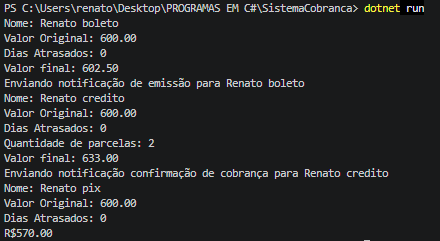
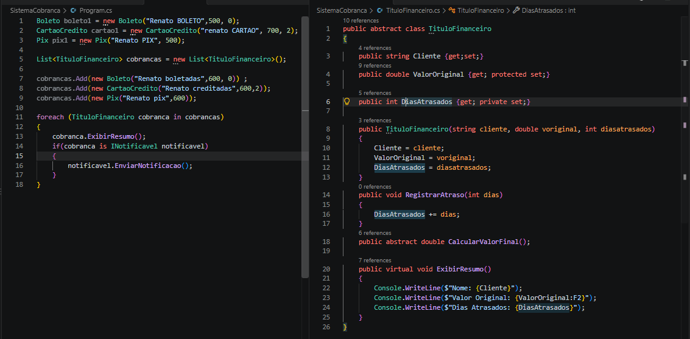

# SistemaCobranca

Sistema de cobrança desenvolvido em C#/.NET para praticar Programação Orientada a Objetos e regras de negócio.

## Conceitos aplicados

- Classes abstratas
- Herança
- Polimorfismo
- Interfaces
- Pattern Matching
- Coleções genéricas
- Encapsulamento
- Regras de negócio

## Estrutura do projeto

- `TituloFinanceiro` — classe base abstrata
- `Boleto` — cálculo com taxa, multa e juros
- `CartaoCredito` — cálculo com taxa de credenciamento e parcelas
- `Pix` — pagamento com desconto
- `INotificavel` — contrato para notificações
- `Program.cs` — execução e testes do sistema

## Demonstração

### Execução no terminal



### Estrutura do código



## Como executar

```bash
dotnet run
